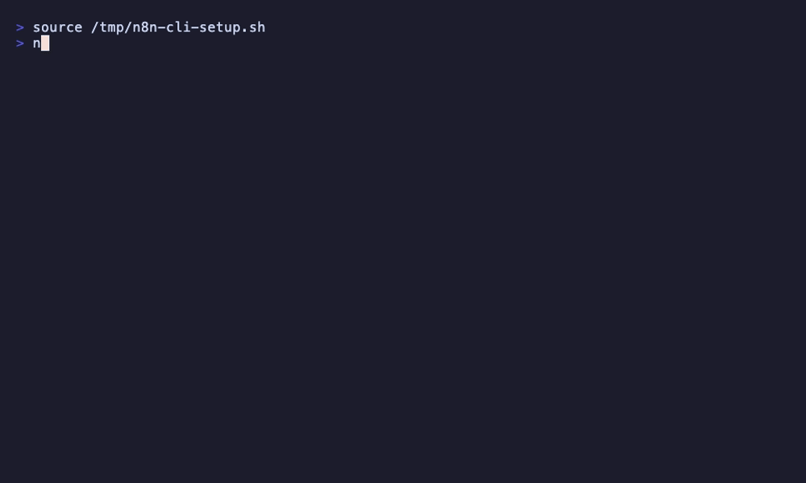

# n8n-cli

[](https://www.python.org/downloads/)
[](https://opensource.org/licenses/MIT)
[](https://github.com/8Dvibes/n8n-cli/releases)
[](https://github.com/8Dvibes/n8n-cli)

**CLI programable y conectable (pipeable) para la API REST de n8n. Cero dependencias externas.**

Más de 80 comandos. Catálogo de nodos que se actualiza automáticamente (543+ nodos). Perfiles multi-instancia. Funciona con n8n Cloud y self-hosted. Incluye 40 habilidades (skills) para Claude Code.




```
$ n8n-cli workflows list --active
ID                   Active   Name
----------------------------------------------------------------------
0NGypLmiqvKIpwrz     Yes      Gmail: Untrash Email (Multi-Account)
11zReJylAUZeh2ev     Yes      Update Event - Team
1Et6fk45FStEU5qc     Yes      Gmail: Remove Label (Multi-Account)

$ n8n-cli nodes search slack
Node                           Display Name              Description
------------------------------------------------------------------------------------------
slack                          Slack                     Consume Slack API
slackTrigger                   Slack Trigger             Handle Slack events via webhooks

$ n8n-cli --json executions list --status error --limit 3 | jq '.[].id'
"7322"
"7316"
"7310"
```

Construido por [AI Build Lab](https://aibuildlab.com) -- enseñando ingeniería de contexto para sistemas agenticos.

## Instalación

```bash
# Desde PyPI
pip install n8n-toolkit

# Desde GitHub
pip install git+https://github.com/8Dvibes/n8n-cli.git

# Desde el código fuente
git clone https://github.com/8Dvibes/n8n-cli.git
cd n8n-cli
pip install .
```

## Inicio Rápido

```bash
# Configura tu instancia de n8n
n8n-cli config set-profile cloud --url "https://your-instance.app.n8n.cloud/api/v1" --key "your-api-key" --default

# O usa variables de entorno
export N8N_API_URL="https://your-instance.app.n8n.cloud/api/v1"
export N8N_API_KEY="your-api-key"

# Verificar conexión
n8n-cli health

# Listar flujos de trabajo (workflows)
n8n-cli workflows list
n8n-cli workflows list --active
n8n-cli wf ls --tag "production"

# Obtener detalles de un workflow
n8n-cli workflows get <id>

# Exportar / Importar
n8n-cli workflows export <id> -o workflow.json
n8n-cli workflows import workflow.json --activate
```

## Habilidades de Claude Code (Claude Code Skills)

n8n-cli incluye **40 [habilidades de Claude Code](https://docs.claude.com/claude-code)**: comandos de barra (slash commands) preconfigurados que enseñan a Claude Code cómo manejar n8n-cli para flujos de trabajo comunes. Una vez instaladas, puedes escribir `/n8n-cli-status`, `/n8n-cli-debug`, `/n8n-cli-create`, etc., dentro de cualquier sesión de Claude Code y Claude ejecutará los comandos de `n8n-cli` adecuados por ti.

```bash
# Ver qué está incluido y qué está instalado
n8n-cli skills list

# Instalar las 40 habilidades en ~/.claude/skills/
n8n-cli skills install

# Instalar solo una
n8n-cli skills install n8n-cli-status

# Sobrescribir existentes
n8n-cli skills install --force

# Imprimir el destino de instalación
n8n-cli skills path
```

Después de instalar, reinicia Claude Code (o abre una nueva sesión) y los comandos de barra aparecerán en tu selector de habilidades.

### Core (las 11 originales)

| Habilidad | Qué hace |
|---|---|
| `/n8n-cli-status` | Verificación de salud, workflows activos, errores recientes: un panel rápido |
| `/n8n-cli-debug` | Extraer ejecuciones fallidas, analizar patrones de error, sugerir correcciones |
| `/n8n-cli-create` | Describe un workflow en inglés, Claude lo construye y lo importa |
| `/n8n-cli-import` | Importa un JSON de workflow con mapeo guiado de credenciales |
| `/n8n-cli-export` | Exporta workflows a JSON para git, respaldo o migración |
| `/n8n-cli-monitor` | Monitorea el flujo de ejecuciones y alerta sobre fallos |
| `/n8n-cli-migrate` | Mueve workflows entre nube y self-hosted (con re-mapeo de credenciales) |
| `/n8n-cli-backup` | Respaldo completo de la instancia en un directorio rastreado por git |
| `/n8n-cli-diff` | Compara workflows entre instancias o contra un JSON local |
| `/n8n-cli-webhook-test` | Envía payloads de prueba a workflows de webhook |
| `/n8n-cli-creds` | Análisis de brechas de credenciales: encuentra qué falta para un workflow |

### Higiene y gobernanza

| Habilidad | Qué hace |
|---|---|
| `/n8n-cli-cleanup` | Busca workflows muertos, credenciales huérfanas, basura sin etiquetas: lista de triaje con recomendaciones de eliminación segura |
| `/n8n-cli-cost` | Análisis de costo de ejecución: mayores consumidores, distribución horaria, sospechosos de spam |
| `/n8n-cli-schedule-audit` | Audita los disparadores programados (Schedule Triggers) en todos los workflows, busca colisiones, sugiere un horario rebalanceado |
| `/n8n-cli-tag-governance` | Encuentra workflows sin etiquetas, propone etiquetas basadas en el contenido, aplica en lote |

### Autoría y refactorización

| Habilidad | Qué hace |
|---|---|
| `/n8n-cli-document` | Genera documentación markdown legible para humanos a partir de un JSON de workflow |
| `/n8n-cli-template` | Convierte un workflow en una plantilla reutilizable, o instancia un nuevo workflow a partir de una |
| `/n8n-cli-refactor` | Analiza un workflow buscando oportunidades de simplificación y propone una refactorización |
| `/n8n-cli-review` | Revisión de cambios en el workflow estilo Pull Request con insignias de riesgo |

### Mapeo de dependencias

| Habilidad | Qué hace |
|---|---|
| `/n8n-cli-deps` | Construye un grafo de dependencias: workflow → sub-workflow → credencial → webhook. Salida como árbol, mermaid o JSON |
| `/n8n-cli-impact` | "¿Si borro X, qué se rompe?" -- análisis inverso del radio de impacto |
| `/n8n-cli-node-usage` | Busca en todos los workflows el uso de un nodo, credencial o patrón específico |

### Operaciones de Producción

| Habilidad | Qué hace |
|---|---|
| `/n8n-cli-meta-monitor` | Genera un meta-workflow dentro de n8n que monitorea todos tus otros workflows y alerta sobre fallos |
| `/n8n-cli-upgrade-preflight` | Verificación previa antes de actualizar n8n: nodos obsoletos, cambios disruptivos, compatibilidad de paquetes |
| `/n8n-cli-bulk` | Operaciones masivas seguras con dry-run obligatorio: activar por etiqueta, archivar por antigüedad, intercambiar credenciales, etc. |

### Pruebas (Testing)

| Habilidad | Qué hace |
|---|---|
| `/n8n-cli-test-fixtures` | Genera payloads de prueba realistas para workflows de webhook (camino feliz + casos borde + error + seguridad) |
| `/n8n-cli-replay` | Extrae una ejecución fallida real, captura su entrada y la reproduce deliberadamente para depuración |
| `/n8n-cli-smoke` | Define y ejecuta una suite de smoke-tests que verifica que los workflows críticos respondan correctamente |

### Puente con otras herramientas

| Habilidad | Qué hace |
|---|---|
| `/n8n-cli-from-mcp` | Convierte un servidor MCP o una habilidad de Claude Code en el workflow de n8n equivalente |
| `/n8n-cli-to-mcp` | Envuelve un workflow de n8n como una herramienta llamable por agentes (MCP, función de OpenAI, herramienta de Anthropic o HTTP) |
| `/n8n-cli-from-cron` | Lee un crontab y genera workflows de n8n equivalentes para cada entrada |
| `/n8n-cli-from-launchd` | Específico de macOS: lee plists de launchd y genera workflows de n8n equivalentes |
| `/n8n-cli-from-zapier` | Migra un Zap de Zapier a un workflow de n8n equivalente |

### Referencia para Expertos

Bibliotecas de referencia en sesión para los internos de n8n. No son comandos de CLI; Claude las consulta como contexto al escribir código o configurar nodos.

| Habilidad | Qué hace |
|---|---|
| `/n8n-code-javascript` | Sintaxis del nodo de código JavaScript: `$input`/`$json`/`$node`, `$helpers`, DateTime, run-once vs run-for-each |
| `/n8n-code-python` | Sintaxis del nodo de código Python (beta): `_input`/`_json`/`_node`, restricciones de solo stdlib |
| `/n8n-expression-syntax` | Sintaxis de expresiones `{{ }}`: `$json`, `$node`, `$vars`, errores comunes y correcciones |
| `/n8n-mcp-tools-expert` | Guía para usar las herramientas del servidor n8n-mcp: selección de herramientas, formato de parámetros, validación |
| `/n8n-node-configuration` | Guía de propiedades de nodos según la operación: campos requeridos, dependencias de propiedades, patrones comunes |
| `/n8n-validation-expert` | Corrige errores de validación de workflows: códigos de error, falsos positivos, problemas de credenciales vs configuración |
| `/n8n-workflow-patterns` | Patrones de arquitectura probados: webhooks, integración de API HTTP, agentes de IA, tareas programadas, operaciones de base de datos |

Las habilidades se instalan en `~/.claude/skills/` por defecto. Sobrescribe con `CLAUDE_SKILLS_DIR=/alguna/ruta n8n-cli skills install`.

## Comandos

### Workflows (`workflows` / `wf`)

```
list [--active] [--inactive] [--tag TAG] [--name NAME] [--project-id ID] [--limit N]
get <id>
create <file.json>
update <id> <file.json>
delete <id>
activate <id>
deactivate <id>
export <id> [-o file.json]
import <file.json> [--activate]
archive <id>
unarchive <id>
transfer <id> <project-id>
tags <id>
set-tags <id> <tag-id> [tag-id...]
clear-tags <id>
```

### Ejecuciones (`executions` / `exec`)

```
list [--workflow-id ID] [--status error|success|waiting|running|new] [--limit N]
get <id>
retry <id>
delete <id>
stop <id>
```

### Credenciales (`credentials` / `creds`)

```
list [--type TYPE] [--limit N]
get <id>
schema <type-name>
create <file.json>
delete <id>
transfer <id> <project-id>
```

### Etiquetas (Tags)

```
list [--limit N]
create <name>
get <id>
update <id> <name>
delete <id>
```

### Variables (`variables` / `vars`)

```
list [--limit N]
create <key> <value>
get <id>
update <id> [--key KEY] [--value VALUE]
delete <id>
```

### Proyectos

```
list [--limit N]
get <id>
create <name>
update <id> <name>
delete <id>
users <id>
```

### Usuarios

```
list [--limit N]
get <id-or-email>
delete <id>
change-role <id> <role>
```

### Paquetes de la Comunidad (`packages` / `pkg`)

```
list
install <npm-package-name>
get <name>
update <name>
uninstall <name>
```

### Nodos (catálogo local, auto-actualizable)

```
search <query>                        Busca en 543+ nodos por palabra clave
get <name> [--full]                   Obtén detalles del nodo (--full para el esquema de propiedades completo)
list [--group G] [--category C] [--credential C] [--ai-tools] [--limit N]
update                                Fuerza la actualización del catálogo desde npm
info                                  Muestra la versión del catálogo en caché
```

El catálogo de nodos se descarga de los paquetes npm oficiales de n8n y se verifica automáticamente en cada uso. No requiere conexión a una instancia de n8n.

### Webhooks (`webhooks` / `wh`)

```
list                                  Lista todas las URLs de webhook de workflows activos
test <workflow-id> [--data '{}'] [--method POST]
```

### Habilidades (Claude Code)

```
list                                  Lista habilidades incluidas + estado de instalación
install [name...] [--force]           Instala habilidades en ~/.claude/skills/
uninstall <name> [name...]            Elimina habilidades instaladas
path                                  Imprime el directorio de destino de instalación
doctor                                Valida cada archivo SKILL.md contra la superficie viva de la CLI
```

### Otros

```
health              Verifica la conectividad de la instancia de n8n
audit               Genera una auditoría de seguridad [--categories credentials,database,filesystem,instance,nodes]
source-control pull Sincronización de control de fuente [--force]
discover            Muestra las capacidades de la API
config show         Muestra el perfil actual
config set-profile  Crea/actualiza un perfil
config list-profiles
config use <name>   Cambia el perfil predeterminado
config delete-profile <name>
```

## Soporte Multi-Instancia

```bash
# Configurar perfiles
n8n-cli config set-profile cloud --url "https://instance.app.n8n.cloud/api/v1" --key "key1" --default
n8n-cli config set-profile selfhosted --url "https://n8n.myserver.com/api/v1" --key "key2"

# Cambiar entre ellos
n8n-cli --profile selfhosted workflows list
n8n-cli --profile cloud health

# O establecer el predeterminado
n8n-cli config use selfhosted
```

## Salida JSON

Añade `--json` a cualquier comando para obtener una salida legible por máquina:

```bash
n8n-cli --json workflows list --active | jq '.[].name'
n8n-cli --json executions list --status error | jq length
```

## Configuración

La configuración se almacena en `~/.n8n-cli.json` (modo 600). Las variables de entorno tienen prioridad:

| Variable | Descripción |
|----------|-------------|
| `N8N_API_URL` | URL base de la API de n8n |
| `N8N_API_KEY` | Clave de la API |
| `N8N_PROFILE` | Nombre del perfil a utilizar |

## ¿Por qué n8n-cli?

| | n8n-cli | Servidores MCP | n8n UI |
|---|---------|-------------|--------|
| Funciona desde cualquier terminal | Sí | No (necesita cliente MCP) | No |
| Conectable / programable | Sí | No | No |
| Cambio multi-instancia | Sí (`--profile`) | Cambio manual de config | Uno a la vez |
| Catálogo de nodos con búsqueda | Sí (543+ nodos, auto-actualizable) | Depende del servidor | Integrado |
| Funciona con cualquier agente de IA | Sí (Bash) | Solo Claude Code | Manual |
| Dependencias | Cero | Node.js + npm | Navegador |

## Ejemplos de Prompts para Agentes de IA

¿No quieres memorizar los comandos? Solo dile a tu agente de IA lo que necesitas:

> "Revisa mi instancia de n8n para ver si hubo ejecuciones fallidas hoy y dime qué salió mal"

> "Exporta todos mis flujos de trabajo activos a una carpeta para control de versiones con git"

> "Construye un flujo de trabajo que revise una hoja de Google Sheets cada mañana y publique un resumen en Slack"

> "Ejecuta una auditoría de seguridad y dime qué credenciales no se están utilizando"

Consulta **[EXAMPLES.md](EXAMPLES.md)** para ver 13 prompts más que puedes copiar y pegar en Claude Code, Cursor, Codex o cualquier agente de IA.

## Requisitos

- Python 3.9+
- Sin dependencias externas (solo stdlib)
- Funciona con instancias de n8n Cloud y self-hosted

## Apoya el Proyecto

Si esto te es útil, así es como puedes ayudar:
- Dale una estrella al repositorio (ayuda a la visibilidad)
- Haz un fork y pruébalo
- Compártelo con tu comunidad de n8n
- [Patrocina](https://github.com/sponsors/8Dvibes) si quieres apoyar el desarrollo continuo
- Abre issues o PRs para las funciones que te gustaría ver

## Contribución

Los issues y PRs son bienvenidos. Este proyecto utiliza cero dependencias externas por diseño; por favor, mantén esa filosofía.

## Licencia

MIT -- ver [LICENSE](LICENSE)

---

Construido por **[AI Build Lab](https://aibuildlab.com)** | [Tyler Fisk](https://github.com/8Dvibes) | [@tyfisk](https://x.com/tyfisk)
