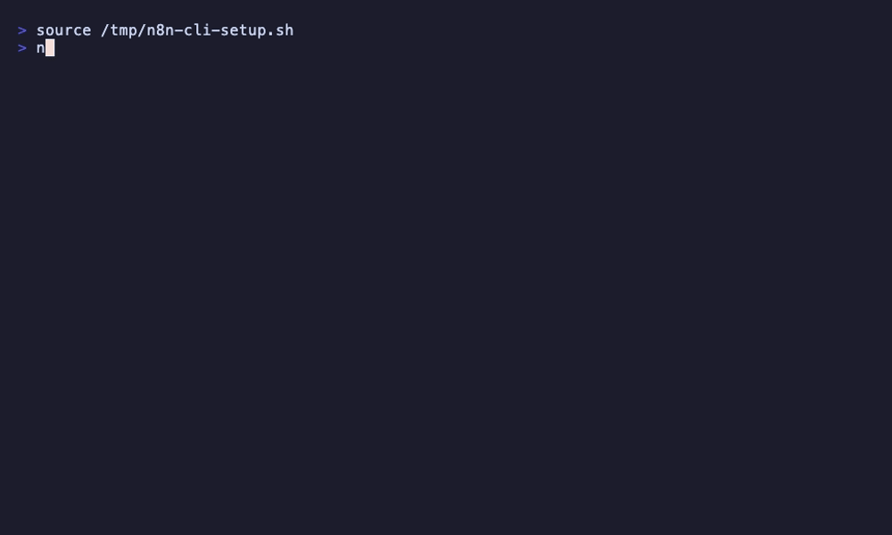

# n8n-cli

[](https://www.python.org/downloads/)
[](https://opensource.org/licenses/MIT)
[](https://github.com/8Dvibes/n8n-cli/releases)
[](https://github.com/8Dvibes/n8n-cli)

**Scriptable, pipeable CLI for the n8n REST API. Zero external dependencies.**

80+ commands. Auto-updating node catalog (543+ nodes). Multi-instance profiles. Works with n8n Cloud and self-hosted.



### AI Agent Integration

Works with Claude Code, Cursor, Codex, Gemini, or any agent that can run Bash:


```
$ n8n-cli workflows list --active
ID                   Active   Name
----------------------------------------------------------------------
0NGypLmiqvKIpwrz     Yes      Gmail: Untrash Email (Multi-Account)
11zReJylAUZeh2ev     Yes      Update Event - Team
1Et6fk45FStEU5qc     Yes      Gmail: Remove Label (Multi-Account)

$ n8n-cli nodes search slack
Node                           Display Name              Description
------------------------------------------------------------------------------------------
slack                          Slack                     Consume Slack API
slackTrigger                   Slack Trigger             Handle Slack events via webhooks

$ n8n-cli --json executions list --status error --limit 3 | jq '.[].id'
"7322"
"7316"
"7310"
```

Built by [AI Build Lab](https://aibuildlab.com) -- teaching context engineering for agentic systems.

## Install

```bash
# From PyPI
pip install n8n-toolkit

# From GitHub
pip install git+https://github.com/8Dvibes/n8n-cli.git

# From source
git clone https://github.com/8Dvibes/n8n-cli.git
cd n8n-cli
pip install .
```

## Quick Start

```bash
# Configure your n8n instance
n8n-cli config set-profile cloud --url "https://your-instance.app.n8n.cloud/api/v1" --key "your-api-key" --default

# Or use environment variables
export N8N_API_URL="https://your-instance.app.n8n.cloud/api/v1"
export N8N_API_KEY="your-api-key"

# Check connection
n8n-cli health

# List workflows
n8n-cli workflows list
n8n-cli workflows list --active
n8n-cli wf ls --tag "production"

# Get workflow details
n8n-cli workflows get <id>

# Export / Import
n8n-cli workflows export <id> -o workflow.json
n8n-cli workflows import workflow.json --activate
```

## Commands

### Workflows (`workflows` / `wf`)

```
list [--active] [--inactive] [--tag TAG] [--name NAME] [--project-id ID] [--limit N]
get <id>
create <file.json>
update <id> <file.json>
delete <id>
activate <id>
deactivate <id>
export <id> [-o file.json]
import <file.json> [--activate]
archive <id>
unarchive <id>
transfer <id> <project-id>
tags <id>
set-tags <id> <tag-id> [tag-id...]
```

### Executions (`executions` / `exec`)

```
list [--workflow-id ID] [--status error|success|waiting|running|new] [--limit N]
get <id>
retry <id>
delete <id>
stop <id>
```

### Credentials (`credentials` / `creds`)

```
list [--type TYPE] [--limit N]
get <id>
schema <type-name>
create <file.json>
delete <id>
transfer <id> <project-id>
```

### Tags

```
list [--limit N]
create <name>
get <id>
update <id> <name>
delete <id>
```

### Variables (`variables` / `vars`)

```
list [--limit N]
create <key> <value>
get <id>
update <id> [--key KEY] [--value VALUE]
delete <id>
```

### Projects

```
list [--limit N]
get <id>
create <name>
update <id> <name>
delete <id>
users <id>
```

### Users

```
list [--limit N]
get <id-or-email>
delete <id>
change-role <id> <role>
```

### Community Packages (`packages` / `pkg`)

```
list
install <npm-package-name>
get <name>
update <name>
uninstall <name>
```

### Nodes (local catalog, auto-updating)

```
search <query>                        Search 543+ nodes by keyword
get <name> [--full]                   Get node details (--full for complete property schema)
list [--group G] [--category C] [--credential C] [--ai-tools] [--limit N]
update                                Force-refresh catalog from npm
info                                  Show cached catalog version
```

The node catalog downloads from official n8n npm packages and auto-checks for updates on every use. No n8n instance connection needed.

### Webhooks (`webhooks` / `wh`)

```
list                                  List all webhook URLs from active workflows
test <workflow-id> [--data '{}'] [--method POST]
```

### Other

```
health              Check n8n instance connectivity
audit               Generate security audit [--categories credentials,database,filesystem,instance,nodes]
source-control pull Source control pull [--force]
discover            Show API capabilities
config show         Show current profile
config set-profile  Create/update a profile
config list-profiles
config use <name>   Switch default profile
config delete-profile <name>
```

## Multi-Instance Support

```bash
# Set up profiles
n8n-cli config set-profile cloud --url "https://instance.app.n8n.cloud/api/v1" --key "key1" --default
n8n-cli config set-profile selfhosted --url "https://n8n.myserver.com/api/v1" --key "key2"

# Switch between them
n8n-cli --profile selfhosted workflows list
n8n-cli --profile cloud health

# Or set default
n8n-cli config use selfhosted
```

## JSON Output

Add `--json` to any command for machine-readable output:

```bash
n8n-cli --json workflows list --active | jq '.[].name'
n8n-cli --json executions list --status error | jq length
```

## Config

Config stored at `~/.n8n-cli.json` (mode 600). Environment variables take priority:

| Variable | Description |
|----------|-------------|
| `N8N_API_URL` | n8n API base URL |
| `N8N_API_KEY` | API key |
| `N8N_PROFILE` | Profile name to use |

## Why n8n-cli?

| | n8n-cli | MCP Servers | n8n UI |
|---|---------|-------------|--------|
| Works from any terminal | Yes | No (needs MCP client) | No |
| Pipeable / scriptable | Yes | No | No |
| Multi-instance switching | Yes (`--profile`) | Manual config swap | One at a time |
| Node catalog with search | Yes (543+ nodes, auto-updating) | Depends on server | Built-in |
| Works with any AI agent | Yes (Bash) | Claude Code only | Manual |
| Dependencies | Zero | Node.js + npm | Browser |

## Example Prompts for AI Agents

Don't want to memorize commands? Just tell your AI agent what you need:

> "Check my n8n instance for any failed executions today and tell me what went wrong"

> "Export all my active workflows to a folder for git version control"

> "Build me a workflow that checks a Google Sheet every morning and posts a summary to Slack"

> "Run a security audit and tell me which credentials aren't being used"

See **[EXAMPLES.md](EXAMPLES.md)** for 13 more copy-paste prompts you can hand to Claude Code, Cursor, Codex, or any AI agent.

## Requirements

- Python 3.9+
- No external dependencies (stdlib only)
- Works with n8n Cloud and self-hosted instances

## Support the Project

If this is useful to you, here's how you can help:
- Star the repo (it helps with discoverability)
- Fork it and try it out
- Share it with your n8n community
- [Sponsor](https://github.com/sponsors/8Dvibes) if you want to support continued development
- File issues or PRs for features you'd like to see

## Contributing

Issues and PRs welcome. This project uses zero external dependencies by design -- please keep it that way.

## License

MIT -- see [LICENSE](LICENSE)

---

Built by **[AI Build Lab](https://aibuildlab.com)** | [Tyler Fisk](https://github.com/8Dvibes) | [@tyfisk](https://x.com/tyfisk)
