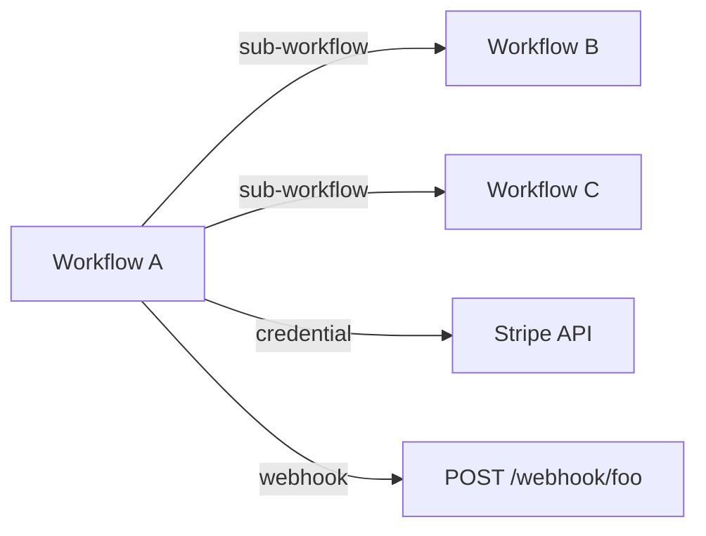

# /n8n-cli-deps — Workflow Dependency Graph

Build and visualize the dependency graph across all workflows in an n8n instance.

## Procedure

1. **Fetch all workflows**:
   - `n8n-cli --json workflows list`
   - For each workflow, `n8n-cli --json wf get <id>` to get full node data

2. **Extract dependencies for each workflow**:
   - **Sub-workflow calls**: nodes with type containing `executeWorkflow` — record the `workflowId` parameter
   - **Credential refs**: any node with a `credentials.<type>.id` field — record the credential ID
   - **Webhook paths**: webhook trigger nodes — record the path
   - **HTTP Request URLs**: outbound HTTP calls — record the URL host (the third-party services this workflow depends on)
   - **Schedule triggers**: cron expression (so we can later cross-reference with /n8n-cli-schedule-audit)

3. **Build the graph** in memory:
   - Nodes: workflows, credentials, webhook paths, external hosts
   - Edges: workflow → sub-workflow, workflow → credential, workflow → webhook, workflow → external_host

4. **Render** in the format the user asked for (default: tree). Options:

### Tree format (default)

```
[Workflow A] (active)
├── calls → [Workflow B]
├── calls → [Workflow C]
├── uses → [Stripe API credential]
├── uses → [Slack OAuth credential]
├── exposes → POST /webhook/foo
└── calls out → api.stripe.com, hooks.slack.com

[Workflow B] (inactive)
└── ...
```

### Mermaid format



### JSON format

```json
{
  "workflows": [...],
  "credentials": [...],
  "webhooks": [...],
  "edges": [
    {"from": "wf_id_a", "to": "wf_id_b", "type": "sub_workflow"},
    {"from": "wf_id_a", "to": "cred_stripe", "type": "credential"},
    ...
  ]
}
```

## Output format

- **Tree** is best for readability, default for human use
- **Mermaid** is best for sharing with the team (pastes into Notion, GitHub, etc.)
- **JSON** is best for piping into another tool

If the user asks for a "map" or "diagram", default to mermaid. If they ask "show me what depends on X", do a single-workflow tree rooted at X.

## Tips

- For instances with 100+ workflows, the full tree is huge. Offer to filter:
  - "Show me deps for workflows tagged 'production'"
  - "Show me deps for workflow X and everything it touches"
  - "Show me orphan workflows" (workflows with no incoming or outgoing dependencies — likely standalone)
- The most useful question this skill answers is: "if I delete this credential / change this webhook / deactivate this workflow, what breaks?" — that's the **/n8n-cli-impact** skill, which uses this graph as input.
- Sub-workflow calls can be deeply nested. Limit recursion to depth 5 to avoid huge trees.
- Save the graph to `~/.cache/n8n-cli/deps.json` so /n8n-cli-impact can reuse it without re-fetching.
